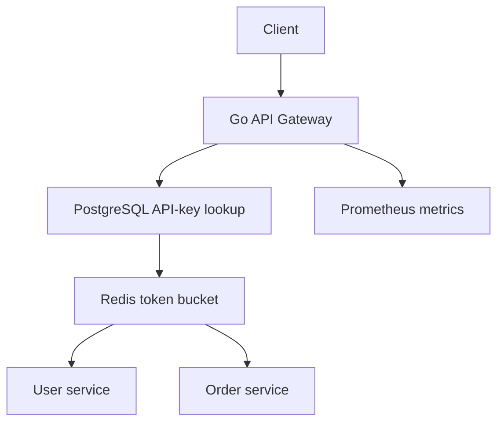

# Distributed API Gateway

A production-style API gateway built in Go to demonstrate backend engineering, persistent API-key management, distributed rate limiting, reverse proxying, observability, and containerized service deployment.

> Phase 2 adds durable identity and quota policy, but this remains a learning project rather than a claim of production readiness. The roadmap covers asynchronous usage logging, dashboards, deployment hardening, and benchmarking.

## What is implemented

- PostgreSQL-backed clients, plans, API keys, and revocation
- One-time API-key issuance with HMAC-SHA-256 database digests
- Per-client and per-route quota policies
- Atomic Redis token-bucket rate limiting using Redis server time
- Reverse-proxy routing to user and order microservices
- Request IDs propagated to upstream services
- JSON structured gateway logs
- Liveness plus Redis and PostgreSQL readiness checks
- Prometheus-compatible metrics endpoint
- Fail-closed rate-limiter behavior by default
- Graceful shutdown and bounded HTTP server timeouts
- Docker Compose development environment
- Unit tests, race-detector CI, vet, formatting, and image build checks

## Architecture



The gateway exposes one entry point while authentication and quota policy stay centralized. PostgreSQL stores durable client configuration; Redis makes token decisions consistent across gateway replicas.

## Quick start

Requirements: Docker with the Compose plugin.

```bash
cp .env.example .env
docker compose up --build -d
```

Verify the stack:

```bash
curl http://localhost:8080/health/live
curl http://localhost:8080/health/ready
curl -H "X-API-Key: dev-key-change-me" http://localhost:8080/api/users
curl -H "X-API-Key: dev-key-change-me" http://localhost:8080/api/orders/101
```

Prometheus is available at `http://localhost:9090`; raw gateway metrics are at `http://localhost:8080/metrics`.

Stop the stack:

```bash
docker compose down
```

## Request flow

1. The gateway assigns or accepts an `X-Request-ID`.
2. Public health and metrics endpoints bypass API authentication.
3. Protected `/api/*` routes HMAC the supplied key and look up an active digest in PostgreSQL.
4. The plan and longest matching client route override determine refill rate and burst capacity.
5. A Redis Lua script refills and consumes a shared token bucket using Redis server time.
6. Accepted requests are routed to the relevant upstream service.
7. The response includes rate-limit and request-tracing headers.
8. Metrics and a structured completion log record the outcome.

When the quota is exhausted, the gateway returns HTTP `429` with `Retry-After`, `X-RateLimit-Limit`, `X-RateLimit-Remaining`, and `X-RateLimit-Reset` headers.

## Routes

| Method | Route | Authentication | Purpose |
|---|---|---:|---|
| `GET` | `/health/live` | No | Process liveness |
| `GET` | `/health/ready` | No | Redis and PostgreSQL readiness |
| `GET` | `/metrics` | No | Prometheus scrape endpoint |
| `GET` | `/api/users` | API key | List mock users |
| `GET` | `/api/users/{id}` | API key | Get a mock user |
| `GET` | `/api/orders` | API key | List mock orders |
| `GET` | `/api/orders/{id}` | API key | Get a mock order |

## Configuration

| Variable | Default | Meaning |
|---|---|---|
| `LISTEN_ADDR` | `:8080` | Gateway listen address |
| `USER_SERVICE_URL` | `http://localhost:8081` | User-service origin |
| `ORDER_SERVICE_URL` | `http://localhost:8082` | Order-service origin |
| `REDIS_ADDR` | `localhost:6379` | Redis address |
| `REDIS_PASSWORD` | empty | Redis password |
| `REDIS_DB` | `0` | Redis database number |
| `DATABASE_URL` | local PostgreSQL URL | Client and key database |
| `API_KEY_PEPPER` | development value | Secret used for HMAC key digests |
| `RATE_LIMIT_FAIL_OPEN` | `false` | Allow traffic when Redis fails |

Never use the development API key in a public deployment. Put production secrets in the VPS secret environment rather than the repository or Compose file.

## Local development without Docker

Start Redis and PostgreSQL, migrate/bootstrap the database, then run each process in a separate terminal:

```bash
go run ./cmd/gateway-admin migrate
go run ./cmd/gateway-admin bootstrap
go run ./cmd/user-service
go run ./cmd/order-service
go run ./cmd/gateway
```

Run verification:

```bash
go test -race ./...
go vet ./...
sh scripts/smoke-test.sh
```

## Repository layout

```text
cmd/                    runnable gateway and mock-service binaries
internal/config/        environment configuration
internal/auth/          API-key generation and HMAC authentication
internal/gateway/       routing and middleware pipeline
internal/ratelimit/     atomic Redis token bucket
internal/store/         PostgreSQL queries and embedded migrations
internal/metrics/       bounded-cardinality Prometheus metrics
internal/mockservice/   demonstration upstream services
deploy/prometheus/      scrape configuration
docs/                   design decisions and roadmap
scripts/                smoke test
```

## Design decisions

- **Token bucket:** permits explicit bursts while enforcing a sustained refill rate; one Redis Lua script makes the decision atomic.
- **Redis server time:** gateway clock drift cannot create extra quota.
- **HMAC key digests:** PostgreSQL never stores recoverable raw API keys, and the pepper is kept outside the database.
- **Longest-prefix overrides:** a client can inherit its plan while receiving narrower quotas for routes such as `/api/orders`.
- **Fail closed:** Redis failure returns `503` by default so quota enforcement is not silently bypassed.
- **Hashed Redis keys:** raw API keys are never stored as Redis key names.
- **Bounded metric labels:** response status is bounded; API keys and raw paths are never labels.
- **Thin gateway:** mock business data lives in upstream services, not in routing middleware.

See [docs/architecture.md](docs/architecture.md) for deeper trade-offs, [docs/api-key-operations.md](docs/api-key-operations.md) for key administration, and [docs/roadmap.md](docs/roadmap.md) for the next milestones.

## Resume-ready description after completion

> Built a Go API gateway with PostgreSQL-backed API-key lifecycle management, per-route plans, an atomic Redis token bucket, reverse-proxy routing, health checks, Prometheus metrics, containerized microservices, integration tests, and CI.

Only add later roadmap features to the resume after they are implemented and verified.
