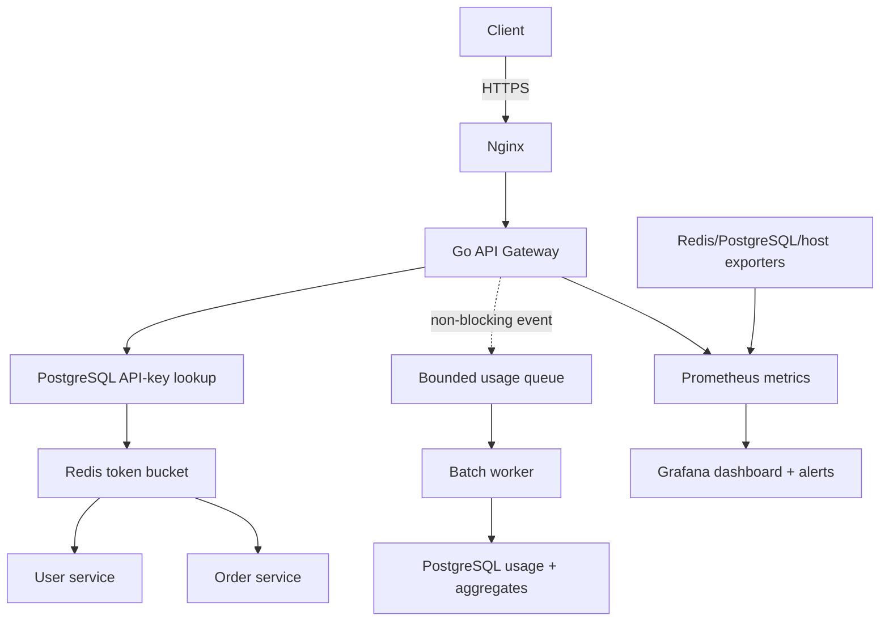

# Distributed API Gateway

A production-style API gateway built in Go to demonstrate backend engineering, persistent API-key management, distributed rate limiting, asynchronous usage processing, reverse proxying, observability, containerized deployment, and evidence-based performance testing.

> Phase 5 adds a repeatable Go/C++ benchmark harness and a committed GitHub Actions baseline. This remains a learning project rather than a universal capacity or production-readiness claim; Phase 6 covers the portfolio finish.

## What is implemented

- PostgreSQL-backed clients, plans, API keys, and revocation
- One-time API-key issuance with HMAC-SHA-256 database digests
- Per-client and per-route quota policies
- Atomic Redis token-bucket rate limiting using Redis server time
- Non-blocking bounded usage-event queue with explicit backpressure
- Batched PostgreSQL usage persistence with retry and dead-letter handling
- Idempotent hourly usage aggregates
- Reverse-proxy routing to user and order microservices
- Request IDs propagated to upstream services
- JSON structured gateway logs
- Liveness plus Redis and PostgreSQL readiness checks
- Prometheus-compatible metrics endpoint
- Fail-closed rate-limiter behavior by default
- Graceful shutdown and bounded HTTP server timeouts
- Docker Compose development environment
- HTTPS-only production Compose stack with Nginx and Certbot
- Private Redis, PostgreSQL, gateway, Prometheus, and exporter networking
- Provisioned Grafana dashboard for traffic, errors, latency, quota denials, queues, dependencies, and host saturation
- Prometheus alert rules, certificate renewal, database backups, deployment, rollback, and incident runbooks
- Repeatable Go and C++20/libcurl end-to-end benchmark clients
- Committed raw request samples, p50/p95/p99 analysis, environment metadata, CSV, and SVG report
- Executable single-/multi-replica and concurrent shared-quota verification
- Unit tests, race-detector CI, vet, formatting, and image build checks

## Architecture



The gateway exposes one entry point while authentication and quota policy stay centralized. PostgreSQL stores durable client configuration; Redis makes token decisions consistent across gateway replicas.

## Quick start

Requirements: Docker with the Compose plugin.

```bash
cp .env.example .env
docker compose up --build -d
```

Verify the stack:

```bash
curl http://localhost:8080/health/live
curl http://localhost:8080/health/ready
curl -H "X-API-Key: dev-key-change-me" http://localhost:8080/api/users
curl -H "X-API-Key: dev-key-change-me" http://localhost:8080/api/orders/101
```

Prometheus is available at `http://localhost:9090`; raw gateway metrics are at `http://localhost:8080/metrics`.

Stop the stack:

```bash
docker compose down
```

## Production deployment

The production stack is intentionally separate from local development. Copy `.env.production.example` to a mode-600 `.env.production`, set real secrets and private upstream URLs, point DNS at the VPS, then run:

```bash
make prod-validate PROD_ENV=.env.production
make prod-tls-init PROD_ENV=.env.production
```

Only Nginx publishes internet-facing ports. Grafana binds to `127.0.0.1:3000`, and all data/metrics services remain private. Production runs migrations but never the development bootstrap, so create a real plan, client, and one-time key with `gateway-admin` after deployment.

Follow [docs/deployment.md](docs/deployment.md) for the complete VPS procedure and [docs/runbook.md](docs/runbook.md) for alerts, backups, restore, and rollback.

## Request flow

1. The gateway assigns or accepts an `X-Request-ID`.
2. Public health and metrics endpoints bypass API authentication.
3. Protected `/api/*` routes HMAC the supplied key and look up an active digest in PostgreSQL.
4. The plan and longest matching client route override determine refill rate and burst capacity.
5. A Redis Lua script refills and consumes a shared token bucket using Redis server time.
6. Accepted requests are routed to the relevant upstream service.
7. The response includes rate-limit and request-tracing headers.
8. Metrics and a structured completion log record the outcome.
9. An authenticated request emits a non-blocking usage event into a bounded queue.
10. A worker writes idempotent batches and hourly aggregates to PostgreSQL; exhausted retries go to dead-letter storage.

When the quota is exhausted, the gateway returns HTTP `429` with `Retry-After`, `X-RateLimit-Limit`, `X-RateLimit-Remaining`, and `X-RateLimit-Reset` headers.

## Routes

| Method | Route | Authentication | Purpose |
|---|---|---:|---|
| `GET` | `/health/live` | No | Process liveness |
| `GET` | `/health/ready` | No | Redis and PostgreSQL readiness |
| `GET` | `/metrics` | No | Prometheus scrape endpoint |
| `GET` | `/api/users` | API key | List mock users |
| `GET` | `/api/users/{id}` | API key | Get a mock user |
| `GET` | `/api/orders` | API key | List mock orders |
| `GET` | `/api/orders/{id}` | API key | Get a mock order |

## Configuration

| Variable | Default | Meaning |
|---|---|---|
| `LISTEN_ADDR` | `:8080` | Gateway listen address |
| `USER_SERVICE_URL` | `http://localhost:8081` | User-service origin |
| `ORDER_SERVICE_URL` | `http://localhost:8082` | Order-service origin |
| `REDIS_ADDR` | `localhost:6379` | Redis address |
| `REDIS_PASSWORD` | empty | Redis password |
| `REDIS_DB` | `0` | Redis database number |
| `DATABASE_URL` | local PostgreSQL URL | Client and key database |
| `API_KEY_PEPPER` | development value | Secret used for HMAC key digests |
| `RATE_LIMIT_FAIL_OPEN` | `false` | Allow traffic when Redis fails |
| `USAGE_QUEUE_CAPACITY` | `1024` | Maximum events waiting in memory |
| `USAGE_BATCH_SIZE` | `100` | Maximum events per PostgreSQL batch |
| `USAGE_FLUSH_INTERVAL` | `1s` | Maximum wait for a partial batch |
| `USAGE_MAX_ATTEMPTS` | `3` | Batch persistence attempts |
| `USAGE_RETRY_BASE_DELAY` | `100ms` | Initial exponential retry delay |
| `USAGE_SHUTDOWN_TIMEOUT` | `5s` | Graceful queue-drain deadline |

Never use the development API key in a public deployment. Put production secrets in the VPS secret environment rather than the repository or Compose file.

## Local development without Docker

Start Redis and PostgreSQL, migrate/bootstrap the database, then run each process in a separate terminal:

```bash
go run ./cmd/gateway-admin migrate
go run ./cmd/gateway-admin bootstrap
go run ./cmd/user-service
go run ./cmd/order-service
go run ./cmd/gateway
```

Run verification:

```bash
go test -race ./...
go vet ./...
sh scripts/smoke-test.sh
make benchmark BENCH_OUTPUT=results/current
```

## Repository layout

```text
cmd/                    runnable gateway and mock-service binaries
internal/config/        environment configuration
internal/auth/          API-key generation and HMAC authentication
internal/gateway/       routing and middleware pipeline
internal/ratelimit/     atomic Redis token bucket
internal/store/         PostgreSQL queries and embedded migrations
internal/usage/         bounded queue, batch worker, retry and dead letters
internal/metrics/       bounded-cardinality Prometheus metrics
internal/mockservice/   demonstration upstream services
internal/benchmark/     benchmark result schema and aggregation
benchmarks/cpp/         independent C++20/libcurl benchmark client
deploy/nginx/           public TLS edge templates
deploy/prometheus/      development and production scrape/alert configuration
deploy/grafana/         provisioned datasource and production dashboard
deploy/systemd/         certificate-renewal and backup timers
docs/                   design, deployment, operations, and roadmap
scripts/                smoke, benchmark, deploy, TLS, backup, and validation automation
results/                immutable measured baseline evidence
```

## Design decisions

- **Token bucket:** permits explicit bursts while enforcing a sustained refill rate; one Redis Lua script makes the decision atomic.
- **Redis server time:** gateway clock drift cannot create extra quota.
- **HMAC key digests:** PostgreSQL never stores recoverable raw API keys, and the pepper is kept outside the database.
- **Longest-prefix overrides:** a client can inherit its plan while receiving narrower quotas for routes such as `/api/orders`.
- **Fail closed:** Redis failure returns `503` by default so quota enforcement is not silently bypassed.
- **Hashed Redis keys:** raw API keys are never stored as Redis key names.
- **Bounded metric labels:** response status is bounded; API keys and raw paths are never labels.
- **Non-blocking usage admission:** a full queue drops and counts the event instead of slowing API responses or growing memory without limit.
- **Idempotent persistence:** event UUID conflicts prevent retried batches from duplicating raw rows or hourly totals.
- **Explicit terminal failure:** batches that exhaust retries are written to a dead-letter table; failure of that fallback is separately counted.
- **Thin gateway:** mock business data lives in upstream services, not in routing middleware.
- **One public edge:** only Nginx binds public ports; metrics, data stores, and administrative surfaces stay private.
- **Provisioned observability:** dashboard, scrape targets, and alert rules are versioned and validated alongside the application.
- **Reproducible operations:** scripts validate, deploy, renew, and back up; runbooks make verification and rollback explicit.
- **Evidence before optimization:** raw per-request samples, environment metadata, executable assertions, and generated reports keep measured facts separate from interpretation.

See [docs/architecture.md](docs/architecture.md) for deeper trade-offs, [docs/api-key-operations.md](docs/api-key-operations.md) for key administration, [docs/usage-logging.md](docs/usage-logging.md) for pipeline operations, [docs/deployment.md](docs/deployment.md) for VPS operations, [docs/benchmarking.md](docs/benchmarking.md) for the measured methodology, and [docs/roadmap.md](docs/roadmap.md) for the next milestones.

## Verified resume-ready bullets

- Built a Go API gateway with PostgreSQL-backed API-key lifecycle management, atomic Redis token-bucket quotas, bounded asynchronous usage logging, an Nginx/HTTPS deployment stack, and provisioned Prometheus/Grafana monitoring.
- Measured 1,987.70 req/s at p95 30.91 ms on one gateway and 1,827.84 req/s at p95 32.79 ms across three gateways in 2,000-request GitHub Actions scenarios with 0% errors; committed every raw request sample and the runner environment.
- Verified one shared quota across three replicas under 100 concurrent requests: 4 accepted, 96 denied, all required rate-limit headers present, and the accepted count below the computed maximum of 5.

These numbers describe the committed runner and workload, not general production capacity. Only add later roadmap features after they are implemented and verified.
