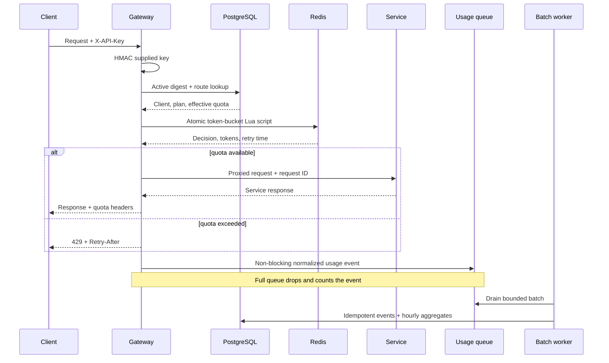

# Architecture and design notes

## Current Phase 3 boundary

The current milestone extends the authenticated request path with bounded asynchronous usage processing:

## Components

### Gateway

The Go gateway is stateless. Configuration comes from environment variables, and shared quota state lives in Redis. This permits horizontal replication behind Nginx without each instance maintaining conflicting local counters.

Middleware responsibilities are separated:

1. Request ID creation and propagation
2. Panic recovery
3. Metrics and structured access logging
4. API-key authentication
5. Distributed rate limiting
6. Route selection and reverse proxying
7. Non-blocking usage emission after the outcome is known

### PostgreSQL authentication and policy

Plans define a default requests-per-second refill rate and burst capacity. Clients belong to a plan and may have longest-prefix route overrides. API keys contain only a display prefix and a 32-byte HMAC-SHA-256 digest; the raw value is returned once by the admin CLI and cannot be reconstructed from the database.

Revocation sets `revoked_at`. Authentication joins the active key, client, plan, and best matching route override in one query, so revocation takes effect on the next request without an in-memory cache window.

### Redis limiter

The token-bucket algorithm performs the following operations in one Lua script:

1. Read Redis server time.
2. Refill integer microtokens up to the configured burst capacity.
3. Consume one request token when available.
4. Persist the remaining tokens and timestamp with a bounded TTL.
5. Return remaining capacity and an exact retry delay.

Lua execution is atomic in Redis, preventing races between gateway processes. Buckets are isolated by API-key ID and normalized route. Integer microtokens avoid floating-point drift, and Redis server time avoids inconsistent decisions from host clock skew.

### Reverse proxy

Routes are selected by stable path prefixes. The gateway preserves the request path, sets the upstream host, forwards the request ID, and converts connection failures into a consistent `502` JSON response.

### Asynchronous usage pipeline

Authenticated request outcomes are copied into privacy-conscious events containing internal client/key IDs, normalized route, method, status, duration, byte count, and occurrence time. API keys, query strings, headers, and bodies never enter the pipeline.

Admission uses a non-blocking send to a bounded channel. A full channel increments a drop counter while leaving request latency unchanged. One worker drains batches by size or time, retries transient PostgreSQL failures with bounded exponential backoff, and writes terminal failures to `usage_dead_letters`.

Each event has a random UUID. PostgreSQL inserts raw events with a conflict guard and derives hourly aggregate changes only from rows inserted by that statement. Retrying a partially uncertain batch therefore cannot double-count it.

### Observability

The gateway exposes Prometheus text-format counters and gauges. Labels are intentionally bounded to status codes. API keys, request IDs, and unnormalized resource paths would create unbounded cardinality and are therefore excluded. Usage metrics expose queue depth, admission, drops, retries, persisted batches/events, and dead-letter outcomes without per-client labels.

Liveness only confirms that the process can serve HTTP. Readiness pings Redis and PostgreSQL because the gateway requires both dependencies before it should receive protected traffic.

## Failure behavior

| Failure | Gateway response | Reasoning |
|---|---|---|
| Missing/invalid API key | `401` | Caller is unauthenticated |
| Quota exhausted | `429` | Caller should retry after reset |
| PostgreSQL unavailable | `503` | Authentication policy cannot be loaded |
| Redis unavailable | `503` | Enforcement dependency unavailable |
| Upstream unavailable | `502` | Gateway could not obtain an upstream response |
| Unknown API path | `404` | No route is configured |
| Usage queue full | API response is unchanged | Event is dropped and counted; latency and memory remain bounded |
| Usage write fails transiently | API response is unchanged | Worker retries the idempotent batch with exponential backoff |
| Usage retries exhausted | API response is unchanged | Events move to PostgreSQL dead-letter storage |
| Dead-letter write fails | API response is unchanged | Events are counted as dropped and an error is logged |

`RATE_LIMIT_FAIL_OPEN=true` is available for experiments, but the default is fail closed. In a real service, this choice depends on whether availability or quota/security enforcement has higher business priority.

## Security notes

- HTTPS terminates at Nginx in the deployment milestone.
- Development keys must be replaced before internet exposure.
- API keys are generated with 256 bits of entropy and stored only as peppered HMAC digests with metadata and revocation state.
- `/metrics` should be network-restricted rather than publicly exposed.
- Redis and upstream services should only be reachable on private networks.
- Request bodies and API keys are not written to logs.
- Usage rows contain normalized routes and internal UUIDs, never raw keys, query strings, headers, or bodies.

## Scaling path

The next deployment topology places Nginx and two or more gateway replicas on the VPS, sharing Redis and PostgreSQL. Each replica currently has its own bounded in-memory usage queue; idempotent UUID storage remains safe across replicas. Laptop-hosted upstream services connect through Tailscale during the demonstration phase. Production services would normally run in the same private infrastructure rather than on a personal laptop.
