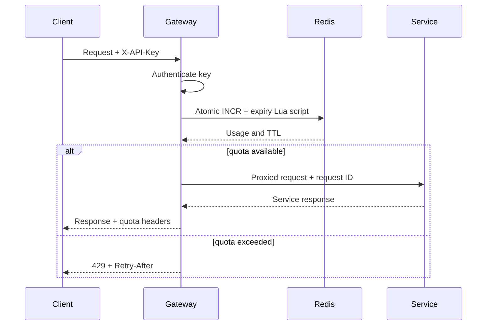

# Architecture and design notes

## Phase 1 boundary

Phase 1 establishes a small but defensible request path:

## Components

### Gateway

The Go gateway is stateless. Configuration comes from environment variables, and shared quota state lives in Redis. This permits horizontal replication behind Nginx without each instance maintaining conflicting local counters.

Middleware responsibilities are separated:

1. Request ID creation and propagation
2. Panic recovery
3. Metrics and structured access logging
4. API-key authentication
5. Distributed rate limiting
6. Route selection and reverse proxying

### Redis limiter

The fixed-window algorithm performs the following operations in one Lua script:

1. Increment the counter.
2. Set expiration only for the first request in a window.
3. Read the remaining TTL.

Lua execution is atomic in Redis, preventing races between multiple gateway processes. The Redis key uses a truncated SHA-256 digest of the API key so raw credentials do not appear in key listings.

Fixed windows can allow bursts at a window boundary. A token bucket is the planned Phase 2 policy because it permits controlled bursts while smoothing sustained traffic.

### Reverse proxy

Routes are selected by stable path prefixes. The gateway preserves the request path, sets the upstream host, forwards the request ID, and converts connection failures into a consistent `502` JSON response.

### Observability

The gateway exposes Prometheus text-format counters and a gauge. Labels are intentionally bounded to status codes. API keys, request IDs, and unnormalized resource paths would create unbounded cardinality and are therefore excluded.

Liveness only confirms that the process can serve HTTP. Readiness pings Redis because the default fail-closed policy requires Redis before the gateway should receive protected traffic.

## Failure behavior

| Failure | Gateway response | Reasoning |
|---|---|---|
| Missing/invalid API key | `401` | Caller is unauthenticated |
| Quota exhausted | `429` | Caller should retry after reset |
| Redis unavailable | `503` | Enforcement dependency unavailable |
| Upstream unavailable | `502` | Gateway could not obtain an upstream response |
| Unknown API path | `404` | No route is configured |

`RATE_LIMIT_FAIL_OPEN=true` is available for experiments, but the default is fail closed. In a real service, this choice depends on whether availability or quota/security enforcement has higher business priority.

## Security notes

- HTTPS terminates at Nginx in the deployment milestone.
- Development keys must be replaced before internet exposure.
- API keys should eventually be stored as salted hashes with metadata and revocation state in PostgreSQL.
- `/metrics` should be network-restricted rather than publicly exposed.
- Redis and upstream services should only be reachable on private networks.
- Request bodies and API keys are not written to logs.

## Scaling path

The next deployment topology places Nginx and two or more gateway replicas on the VPS, sharing Redis. Laptop-hosted upstream services connect through Tailscale during the demonstration phase. Production services would normally run in the same private infrastructure rather than on a personal laptop.
